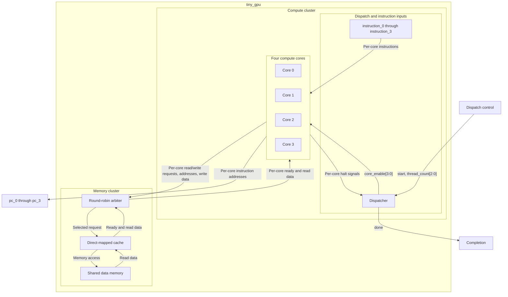

# Tiny GPU -- Four-Core Processor in SystemVerilog
A GPU-style processor (MIMD Design) built to explore parallel execution, instruction-set design, and modular RTL verification. The design combines four  8-bit compute cores with a dispatcher that enables one to four cores and detects when all active cores have halted. 

I started this project after building a [SAP-1](https://github.com/J0S321/SAP-1-Verilog) computer in Verilog. My goal is to understand how individual modules work together, then extent that foundation to parallel computing and memory hierarchy. 

**Status: In progress**
See the [Development log](docs/README.md) for module development, testbenches, and waveforms. 

## At a Glance
| Feature | Current Design |
| --- | --- |
| Compute Cores | Four independent cores; one to four enabled per dispatch
| Instruction format | 16 bits, with 4-bit opcode | 
| Datapath | 8-bit integer arithmetic and logic |
| Registers | Sixteen 8-bit registers per core; three read ports and one write port |
| Program Counter | One 8-bit PC per core | 
| Instruction Memory | 256 x 16 bits, four combinational read ports, initialized with $readmemh |
| Data memory | 2556 x 8 bits, synchronous writes and combinational reads | 
| Cache | Sixteen direct-mapped entries, each with an 8-bit data value, 4-bit tag, and valid bit | 
| Cache policy | Read-miss saves, write-through, and no write allocation |
| Memory arbiter | Four request interfaces share one cache interface using round-robin selection | 
| Memory handshake | Each core waits for its memory-ready signal before completing a load or store | 
| Simulation | Icarus Verilog, directed SystemVerilog testbenches, VCD waveform inspection | 

## Architecture 

**PLACE HOLDER DIAGRAM FOR NOW** 
The `tiny_gpu` top level contains two clusteres: 
- Compute Cluster: A dispatcher and four compute cores. The dispatcher selects what cores are active and reports when all active cores have finished. 
- Memory Cluster: A memory arbiter, cache, and shared data memory. The arbiter selects one requesting core and routes the response back to that same core

### Compute Cores
Each core contains a program counter, instruction decoder, control unit, register file, ALU, and write-back multiplexer. The register file supplies two source operands and the previous destination value for multiple-accumulate operations. A separate equality comparison drives conditional branches. 

Each core follow its own instructions. `core_enable` controls PC updates, register writes, and memory request. During a `LOAD` OR `STORE`, the core holds its PC until the memory cluster asserts that it got a response.

### Shared Memory 
The arbiter allows one core to have access to the cache and keeps that grant until the transaction is complete. After its finished, it advances the starting priority for the next round-robin selection.

The cache uses address bits [3:0] as the index and [7:4] as the tag. A read miss fetches data from shared memory and fills that selected entry. Writes update shared memory; a write hit also updates the cache value. A write miss does not save an entry 

### Instruction 
Instruction memory exist as a separate module. The current `tiny_gpu` interface accepts `instruction_0` through `instruction_3` from an external source and exposes each core's PC. in the top-level testbench, a PC-indexed instruction sequence supplies these inputs. 

The instruction-memory module is not implemented inside of the current top level 

## Top-Level Interface 
| Direction | Signal | Purpose | 
| --- | --- |---|
| Input | `clk`, `rst` | Clock and reset | 
| Input | `start`      | Start a dispatch|
| Input | `thread_count[2:0]` | Select one to four active cores | 
| Input | `instruction_0` - `instruction_3` | Instruction for each core | 
| Output| `done` | All active cores halted | 
| Output | `pc_0` - `pc_3` | Per-core instruction address | 
| Output | `store_valid[3:0]` | Identify completed stores by core | 
| Output | `result_address[3:0][7:0]` | Per-core store addresses | 
| Output | `result_data[3:0][7:0]`    | Per-core store data |

Store address and data outputs are seen when the corresponding `store_valid` bit is asserted. 

## Instruction Set
| Opcode | Instruction | Operation |
| `0000` | `NOP`       | Advance without modifying registers or memory | 
| `0001` | `LDI`       | Loads an 8-bit immediate into a register |
| `0010` | `STORE`     | Write a register value to an 8-bit memory address |
| `0011` | `MOV`       | Copy a register value | 
| `0100` | `ADD`       | Add two register values | 
| `0101` | `SUB`       | Subtract two register values | 
| `0110` | `MUL`       | Multiply two register values | 
| `0111` | `MAC`       | Add a product to the previous destination value | 
| `1000` | `AND`       | Bitwise AND | 
| `1001` | `OR`        | Bitwise OR  |
| `1010` | `XOR`       | Bitwise XOR |
| `1100` | `BEQ`       | Branch to an absolute 4-bit address if two register are equal |
| `1101` | `BNE`       | Branch to an absolute 4-bit address if two register are not equal |
| `1110` | `LOAD`      | Load memory-read data into a register |
| `1111` | `HALT`      | Hold the PC and signal that the core has finished | 

Arithmetic results written to register retain the low eight bits. Conditional branch targets are zero-extended from four bits. `JMP` uses the full eight-bit immediate. 

The opcode occupies bits [15:12]. For `LDI` and `LOAD`, bits [11:8] select the destination register and bits `[7:0]` hold the immediate or memory address.  For `STORE`, bits `[11:8]` select the source register and bits `[7:0]` hold the memory address 

See the **instruction-format** reference for the field layout. 

## Run the Integration Test

With Icarus Verilog installed run these commands from the repository root. They assume the integrated RTL is in `src/` and the testbench is in `tb/` 

mkdir -p build

iverilog -g2012 -s tiny_gpu_tb \
  -o build/tiny_gpu_tb.vvp \
  src/*.sv tb/tiny_gpu_tb.sv

vvp build/tiny_gpu_tb.vvp

The testbench generates `tiny_gpu_tb.vcd` in the working directory. To inspect it with Surfer: 

surfer tiny_gpu_tb.vcd 

## Single-Core Demo 
The test enables core 0 and leaves core 1-3 disabled: 

1. Load `R1 = 5` and `R2 = 7`
2. Compute `R3 = R1 + R2 = 12`. 
3. Store `R3` at address `0x00`. 
4. Load address `0x00` into `R4`. 
5. Compute `R5 = R1 + R4 = 17`. 
6. Store `R5` at address `0x21`. 
7. Execute `HALT` and check `done`. 

| Store | Address | Expected Data (Decimal) |
| ---   |  ----   | ----                    |
|First | `0x00` | 12 
| Second | `0x21` | 17 | 

The test checks the two stores, PC stalls when access memory, disabled-core PCs, and completion before a timeout. The second result depends on data loaded through the complete memory subsystem. 

## Verification 
Verificaiton combines directed stimulus, expected-versus-actual comparisons, and waveform inspection. Testbenches are developed alongside individual modules and expanded as components are connected. 

| Test area | Existing checks | 
|---|---|
| ALU | Arithemtic and logical operations, multiply-accumulate, and status flags | 
| Control Unit | Insturction control signals and taken/not-taken branch conditions | 
| Program Counter | Resets, increment, target loading, halt, and enable behavior | 
| Dispatcher | One through four active core, thread IDs, and completion signaling | 
| Compute Core | Instruction sequences and interactions between datapath components | 
| Compute Cluster | Per-core PCs, memory-request signals, write data, and disbaled-core behavior | 
| Instruction Memory | Expected instruction words on all four output ports | 
| Data Memory | Writes, readback, retention, overwrites, and disabled reads | 

Waveform captures the development history are available in the **development log**. The repository does not yet include complete cache/full-system regression, UVM environment, or coverage reoprt. 

## Design Scope
Each core has its own PC and registers, allowing it to run its own instructions. The core can perform calculations at the same time, while the arbiter lets one core access the shared memory on at a time 

The design uses 8-bit data and a simple cache to make the hardware easier to understand and debug. 

Testing curretly uses simulation. Measuring hardware timing, resource usages, and automated test coverage is planned for the future work. 

## Next Steps
[ ] end-to-end multicore memory testing: Verify multiple cores share the arbiter, cache, and data memory 

[ ] UVM verification: build a verification environment with monitors, scoreboards, and functional coverage. 

[ ] Full SIMT implementation 
