# Development Log
Learning GPU architecture by building a small Verilog-based GPU for parallel matrix operations. 

[← Back to Tiny GPU overview](../README.md)
## Inspiration

This project was inspired by Adam Maj's Tiny GPU project, a small GPU implementation written in System Verilog to explore GPU architecture from the ground up. 

My goal with this repository is to develop my own understanding of GPU architecture, Verilog design, instruction-set design, and parallel computation by implementing and documenting similar concepts step by step.

## Previous Work

While preparing to build the Tiny GPU, I started a side project that introduced me to components such as registers, RAM, the program counter, instruction register, ALU, control unit, and a top-level datapath integration.

That project was a SAP-1 computer written entirely in Verilog. It taught me many of the fundamental concepts that will be reused and expanded on in this project. 

Rather than documenting all of those concepts from scratch all over again, this project builds upon that foundation and applies them to a GPU-style parallel architecture. 

[SAP-1 Verilog Project](https://github.com/J0S321/SAP-1-Verilog)

## Modules

### Instruction Decoder

The instruction decoder receives a 16-bit instruction and separates it into an opcode and three 4-bit fields. 

The instruction format is:
| Bit     | Purpose |
|---------|---------|
|`[15:12]`| Opcode  |
|`[11:8]` | Field 1 |
| `[7:4]` | Field 2 |
| `[3:0]` | Field 3 |

The meaning of each field depends entire ont he opcode. For arithmetic instructions, the field may represent the destination and source register addresses.

For instructions that use an immediate value or memory address, fields 2 and 3 are then concatenated together to create an 8-bit `imm8` output:

`imm8 = {field2, field3}`

### Why the Decoder is Separate from the Control Unit

The instruction decoder is responsible only for separating the instruction into its individual fields.

The control unit uses the opcode to determine what operation should be performed and generates the necessary signals for the components like the register file, ALU, memory, and the program counter.

Keeping these modules separate makes each component easier to understand, test, debug, and reuse. 

#### Testbench

The testbench verifies that the 16'bit instruction is correctly separated into the opcode and three 4-bit fields. It also verifies that fields 2 and 3 are concatenated correctly to produce the 8'bit `imm8` value. 

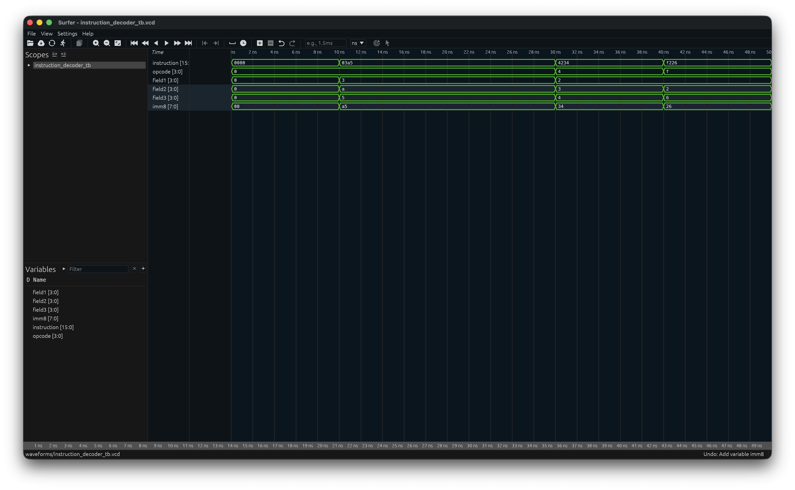

### Register File

Wow, now we are getting into some heavier-duty components. This module contains sixteen 8-bit register and provides one write port and two read ports.

Data can be written into the reigster file by selected a register with `write_address` and asserting `write_enable`. On the rising edge of the clock `write_data` will be stored in the selceted register. 

The module also reads from two register simultaneously. `read_address_1` and `read_address_2` select the register. While the stored values are displayed through `read_data_1` and `read_data_2`

When `rst` is asserted, all sixteen register are cleared back to `0000_0000`.

#### Testbench

The testbench verifies that value can be written into different registers and read through both read ports. 

It also confirms that the register hold their value while `write_enable` is disabled, even if `write_address` and `wite_data` changes. 

At the end of the simulation, `rst` is asserted again to verify that all of the used register are cleared.

As the modules have now become more complex, I plan to begin using self-checking testbenches so that the expected values can be verified autoatically instead of relying entirely on waveform inspections. 

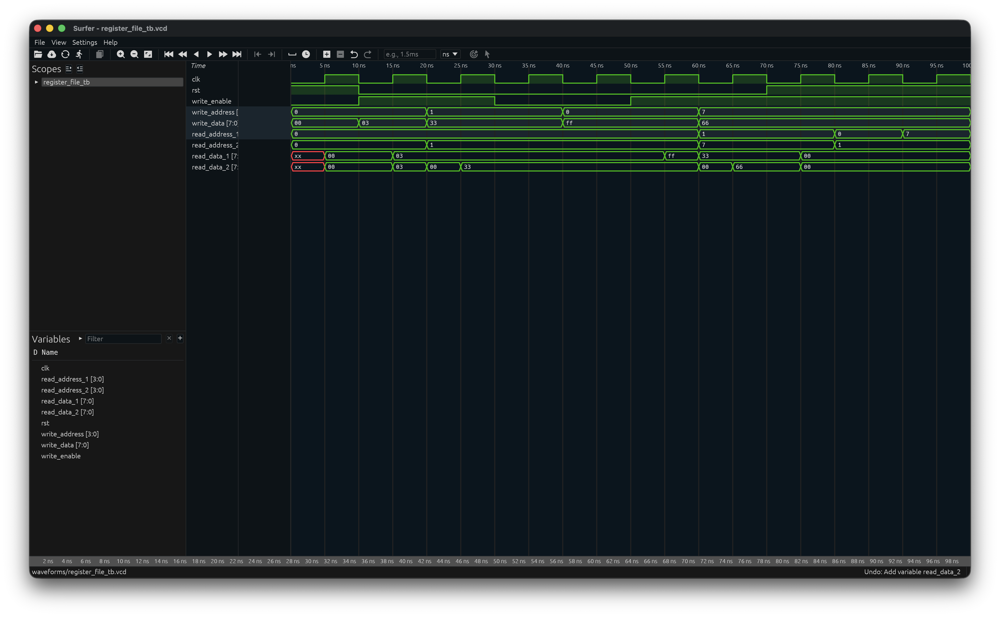

### ALU
This was another interesting module. The Arithmetic Logic Unit, or ALU for short, is where most of the computational operations happen inside a processor. For my Tiny GPU, the ALU can perform addition, subtraction, multiplication, AND, OR, and XOR operations. 

These operations are selected using the `alu_operation` input. The control unit will eventually use the opcode from the instruction set to determine what value should be sent through `alu_operation`. 

One of the main things I learned while creating this module was how overflow works for different arithemtic operations. 

For addition, overflow happens when the two operands have the same signs, and the sign of the result differs from operand A. 

For subtraction, overflow occurs when the two operands have different signs, and the sign of the result differs from operand A. 

Multiplication works a little bit differently because multiplying two 8-bit values can produce a 16-bit result. The lower eight bits are stored in `result`. While the upper eight bits are checked for overflow. If any bit in the `produce[15:0]` is a `1`, then the complete result couldn't fit into the 8'bit output. 

The zero flag is more straightforward. After the ALU finishes an operation, it check wether the final result is `0000_0000`. If it is, then `zeroflag` is asserted. 

#### Testbench
For this module, I designed a self-checking testbench. The initialization is similar to my previous testbenches, but I introduced a new SystemVerilog feature called a `task`. 

A task allows me to create a reusable block of testbench code with parameters: 
```Verilog
    task check_alu
    (
        input [7:0] a,
        input [7:0] b,
        input [2:0] operation,

        input [7:0] expected_result, 
        input expected_zero, 
        input expected_carry,
        input expected_overflow
    );
```

Tasks are basically like functions in C/C++. Using the parameter, the task would apply the operands and operation to the ALU and compare the actual outputs against the expected result, zero flag, carry flag, and overflow flag. 

If all of the values matc, then the testbench displays that the test passed in the terminal. 

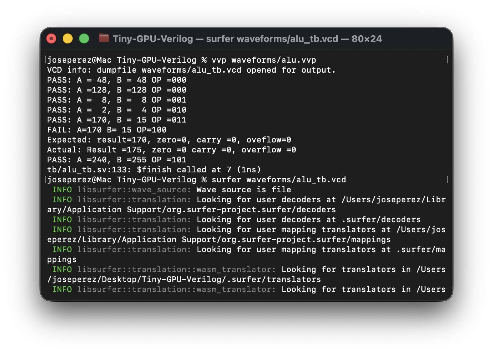

Now, if a value does not match, the testbench displays a failure message along with the expected values and the actual values produced by the ALU. This makes debugging so much easier than relying solely on the waveform inspections. 


I also placed the simulation delay inside of the task itself; because of this, the initial block only needs to call the `check_alu` with only different operands, operations, and expected values.

After testing the different ALU operations and flag conditions, all of the tests produced the expected results 

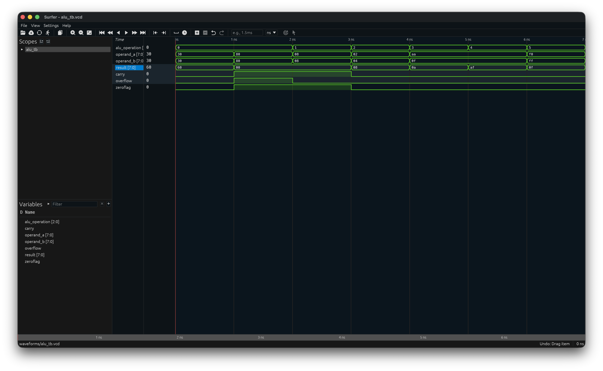

### Program Counter
The next module I created was the Program Counter. I won't go too deep into how this module works because I already explained the basic idea in my SAP-1 project. However, this Program Counter differs from the SAP-1's version because it can also receive a new address and jump directly to it by using the `[7:0] next_pc` input. 

Normally, the Program Counter increments by one on every rising edge of the clock. However, when `pc_load` is asserted, instead of incrementing the Program Counter loads the value that is stored in `next_pc`. This will be really useful for the branch instructions where the processor needs to continue execution from a different instruction address. 

#### Testbench
The testbench wasn't too difficult ot create. I was mainly getting more practice with using `task` inside of my testbenches. A self-checking task wasn't really necessary for a simple module like this one, but it was goo practice for verify the sequential logic. 

The task applies the reset, `pc_load` and `next_pc` values, waits for a rising edge of the clock, and then checks whether the actual Program Counter matches the expected value. 

I tested the Program Counter by reseting it to zero, allowing it to increment normally, loading a new address using `next_pc`, and then resetting it again. 

Below are the results of the self-checking testbench. 

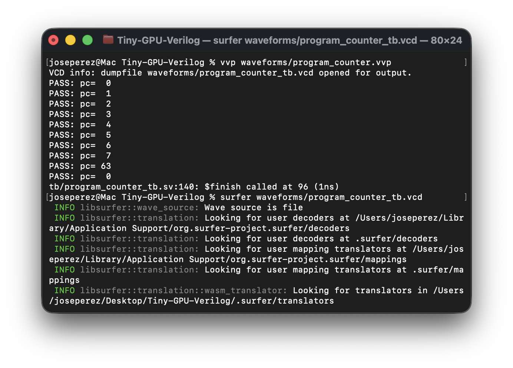

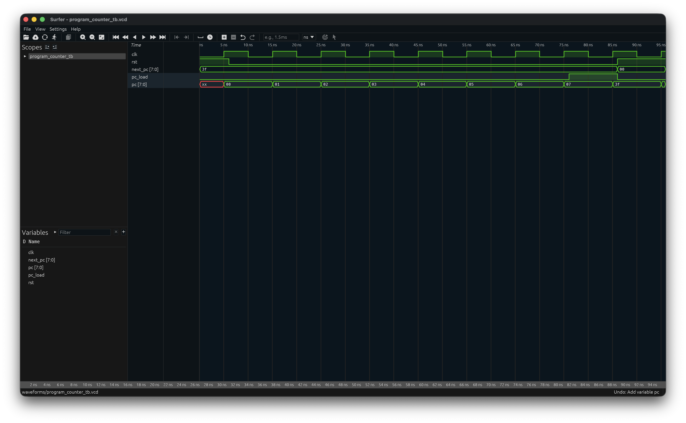

### Control Unit
This was another fascinating module, although it did take a while to complete because I had to make sure that every instruction generated the correct control signals. 

The Control Unit takes 4-bit `opcode` from the Instruction Decoder and uses a `case` statement to determine what the rest of the processor should do. Depending on the instruction, it can enable register write, select an ALU operation, write to memory , load a new Program Counter address, or halt execution. 

The main controls in this unit are: 

- `reg_write_enable` - Allows a value to be written into the Register File. 
- `pc_load` - Allows the PC to load a new address fro jumps and branches. 
- `halt` - Stops the process from continuing any instruction. 
- `alu_operation` - Selects which operation the ALU should perform. 

For example, when the Control Unit gets the `ADD` opcode, it selects the ADD operation in the ALU and asserts `reg_write_enable` so that the result can be written into the destination register:

```Verilog
4'b0100: begin //ADD
    reg_write_enable = 1'b1; 
    alu_operation = 3'b000;
end
```

Another thing I learned was how conditional branch instruction can use the ALU's `zeroflag`. Since both `BEQ` and `BNE` use subtraction to compare two registers. If the subtraction computation produces a zero then that means that the values are equal. 

So for `BEQ`, `pc_load` is asserted when the `zeroflag` is `1`. While the opposite is true for `BNE`, when `zeroflag` is `0` then `pc_load` is asserted. 

Now one of the major problems that I ran while creating the Control Unit was on how to implement the `MAC` instruction. At first I thought I could perform multiplication and then addition by assigning two different values to `alu_operation` inside of the same case block. However since the Control Unit is using combinational logic, the second assignment would overwrite the first one, thus not allowing this method to work. 

To solve this I had to modify the `alu` module. 

#### Modifications
I add a dedicated `MAC` operation to the ALU using the bit values of `3'b110`

```Verilog
4'b0111: begin //MAC
    reg_write_enable = 1'b1; 
    alu_operation = 3'b110; 
end
```

I also added an `accumulator` input to the ALU. This would allow the ALU to now perform: 
`Rd = Rd + (Rs1 * Rs2)`

using the previous value of `Rd` as the accumulator. 

Just to make sure that the module works as intended I also modified the testbench to verify. And everything works corrcetly!

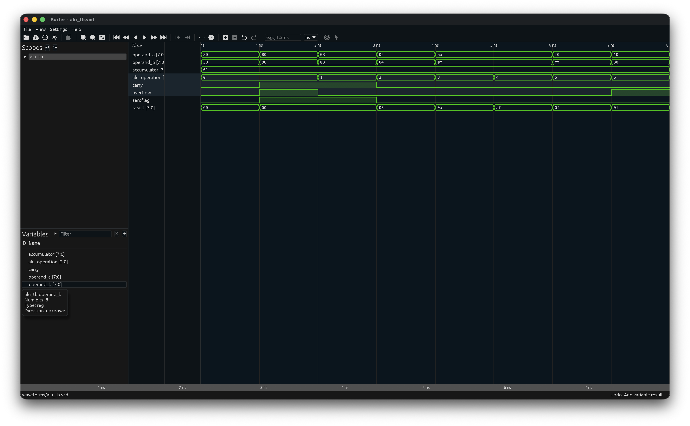


#### Testbench 
The testbench wasn't too difficult to create, it was just tedious since I had to copy the same structure of code for the task a lot of times. None the less I feel much more comfortable writing self-checking testbenches in SystemVerilog now. 

The testbench goes through each opcode and checks wether the expected control signals are asserted. This verifies signals like `reg_write_enable`, `pc_load`, `mem_write`, `halt`, `alu_operation`. 

I also test both possible conditions for `BEQ` and `BNE` instructions. this allowed me to verify that the branch is taken when its conditions are true or ignored when the coditions are false. 


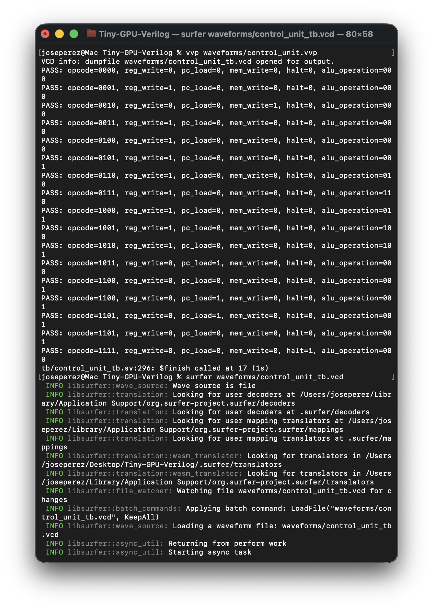

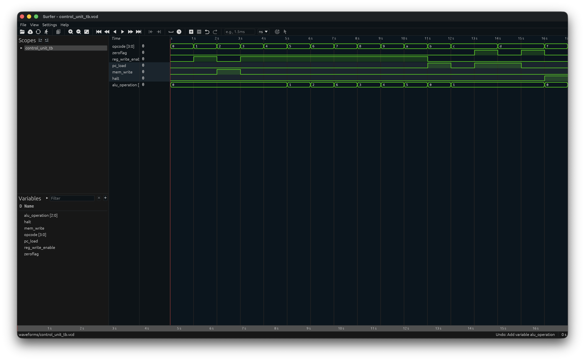


### Writeback Mux
This is a small module that I created to select what data should be written back into `Rd`. It is a 3-to1 mux controlled by the `writeback_select` signal. 

The three possible inputs are: 

`alu_result` - The result produced by the ALU. 
`immediate` - The 8-bit immediate value from the instruction. 
`register_data` - Register data used mainly for the `MOV` instruction. 

The `writeback_select` signal determines which value is sent to the Register File: 

- `2'b01` - ALU result
- `2'b10` - Immediate value
- `2'b11` - Register data
- `2'b00` - Default value of zero

##### Register File
For the Register File, I added a third read port for the `MAC` operation. 

Since `MAC` does the operation: 

`Rd = Rd + (Rs1 * Rs2)`

The ALU needs to read `Rs1`. `Rs2` and the old value of `Rd` at the same time. The third read port allows the old value of `Rd` to be sent into the ALU as the accumulator. 

I also modified the testbench and tested the Register file again to make sure the new changes didn't break any functionality. 

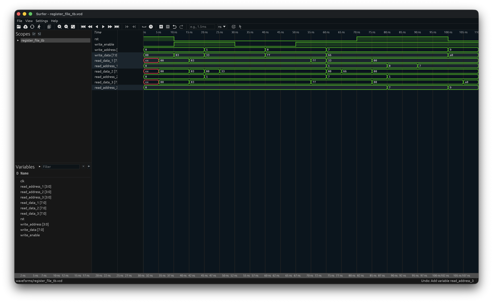

###### Program Counter
For the Program Counter, I added one more input called `halt`. When this signal is asserted, the Program Counter holds its current value instead of continuing to increment. 

I also modified the testbench to check that the Program Counter stays at the same address while `halt` is asserted. 

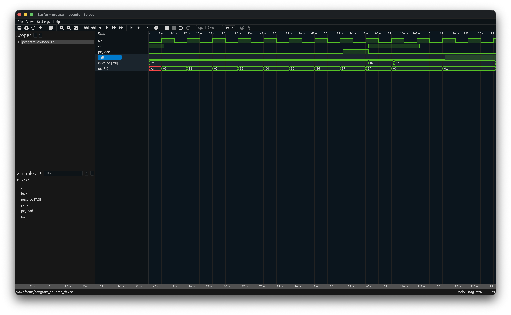

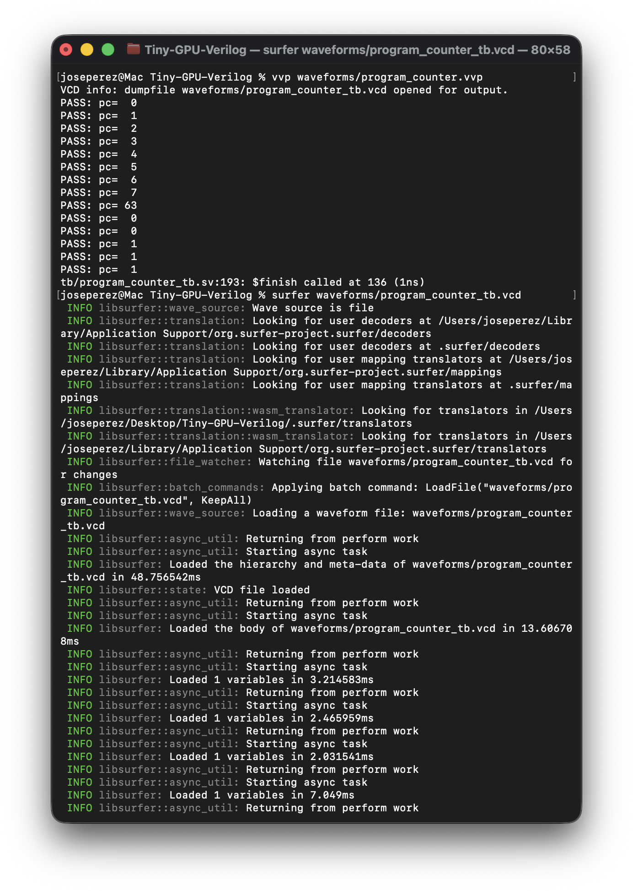

#### Testbench
The testbench for the Writeback Mux is pretty simple. I tested every possible value of `writeback_select` and checked if the correct input was sent to `writeback_data`. 

I also tested the unused `2'b00` selection to make sure that the output was all zeros. 

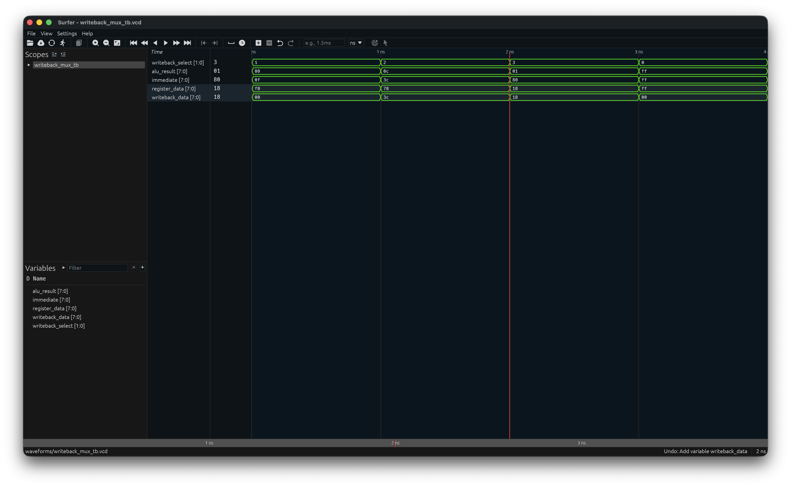

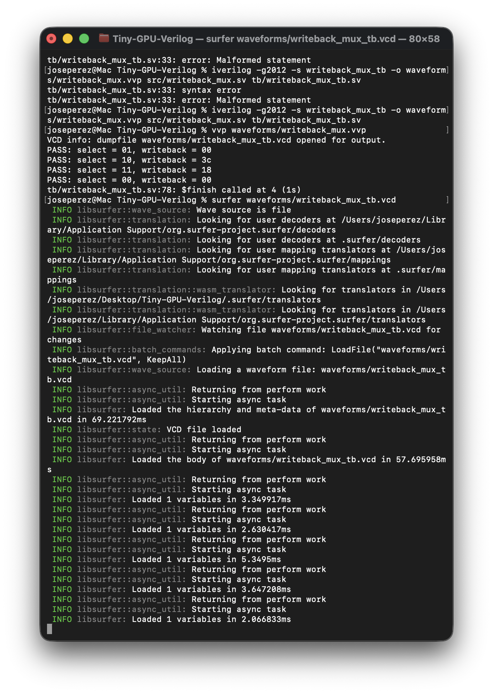

### Compute Core
Wow, this module really took a while to make. I put this project to the side for about two weeks since I was working on a Family Feud game for a SHPE GBM I was hosting during the first week of classes. 

But anyways, let's get back to this module. The compute core basically connects most of the modules I previously created to form the main exectuion unit of the GPU. This GPU will eventually have four compute cores in total, so this module represents one of the four cores. 

While creating the core, I also modified the ISA. I changed the immediate load instruction to `LDI`, which loads an immediate value into a register, and added `LD`, which loads a value from memory into a register. 

For example: 

```text
LDI R1, 5
```

This loads the immediate value 5 into R1, while 

```text
LD R1, 0x10 
```

loads the value in the memory address 0x10 into R1.

The compute core connects the instruction deocder, control unit, register file, ALU, program counter, and writeback mux together. This allows the core to execute arithmetic instructions, move values between registers, access memory, and change program flow using jumps and branches. 

While creating this module, I had trouble simulating it because the simulation would get stuck and wouldn't produce the full waveform when certain instructions were executed. Debugging this help me understand how important it is to avoid combinational loops when connecting different modules together. 

#### Testbench
While writing the testbench, the biggest issue I ran into was that the simulation would stop continuing when it reached the `SUB` instruction. 

The problem was caused by a combinational loop between the control unit and the ALU. The control unit was affecting the ALU operation while also depending on a flag that was produced from the ALU. This caused the simulator to continuously check both module without progressing the simulation time. 

After fixing this, I tested several instructions together to make sure the entire compute core was working properly.

The testbench currently tests instructions like: 
- `LDI`
- `ADD`
- `SUB`
- `MOV` 
- `LD` 
- `STORE`
- `BEQ`
- `BNE` 
- `JMP` 
- `HALT`

I also added registers 0-5 to the waveform to confirm that values were being written to the correct registers. 

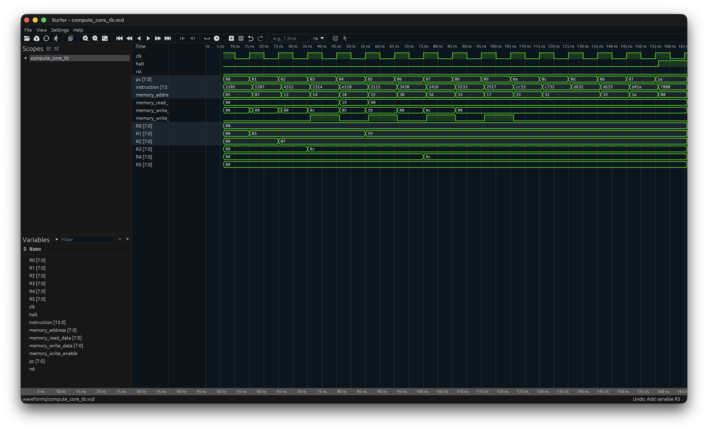

### Instruction_memory
This module wasn't too hard to write. I just needed four different program counter inputs and four instruction outputs, one for each of the four compute cores. 

The main purpose of this module is to allow each core to fetch its own insturction using its own program counter. Since every core has its own PC, they can each request an instruction from a different location in instruction memory. 

The biggest improvement from SAP-1 project is that the program is now being read from an external file instead of being hard-coded directly into memory. This is done using the following code: 

```verilog
initial begin
    $readmemh("programs/program.hex", memory); 
end
```
The `$readmemh` reads the hexadecimal instructions stored inside `program.hex` and loads them into the instruction memory when the simulation begins. 

For example, the program counter file can have 
````text 
1105
1207
4312
F000
````

which in binary is just 
0001 0001 0000 0101 -> LDI, R1, 5
0001 0010 0000 0111 -> LDI, R2, 7
0100 0011 0001 0010 -> ADD, R3, R1, R2
1111 0000 0000 0000 -> HALT 


#### Testbench
The testbench for this module was also straightfoward. I want to make sur ethat the instruction stored inside `program.hex` were correctly loaded into memory and appeared on all four instruction outputs. 

The testbench changes the program counter address and checks that `instruction_0`, `instruction_1`, `instruction_2`, and `instruction_3` all returned the expected 16-bit instruction. 

;

### Dispatcher
Although this module looks tedious because it has 17 ports, it was relatively easy to create. 

The basic functionality of the dispatcher is to manaage the four compute cores. it determines which cores should be enabled using `core_X_enable`, monitors whether each enable core has stopped using its `halt` signal, and asserts done when every active core has finished. 

When `start` is asserted the dispatcher uses a case statement to check `thread_count`. It then enables the corresponding number of cores. For example, a `thread_count` of three enables cores 0, 1, and 2. Each core is also assigned its own thread ID from 0 - 3. 

The internal `busy` signal keeps track of wether teh dispatcher is currently running a group of thread. While `busy` is asserted, the dispatcher check wether every enabled core has asserted its `halt` signal. Once every active core has halted, the dispatcher disables all four cores, clears busy, and asserts `done` signal. 

#### Testbench
The testbench checks all of the supported `thread_count` from one through four. For each thread count, it verfies the core enable signals, thread IDS, halt behavior, and `done` output.

One difficulty I had to resolve involved unasserting `rst`. Originally, reset was being changed at the same time as a postive clock edge which just created a race condition. I fixed this by implementing

```` verilog
    repeat (2) @(posedge clk);
    @(negedge clk);
````

The `repeat` statement waits for two positive clock edges so the synchronous reset is recognized by the dispatcher. The testbench then waits for a negative clock edge before deasserting `rst`, preventing reset from changing at the same time as the active clock edge. 

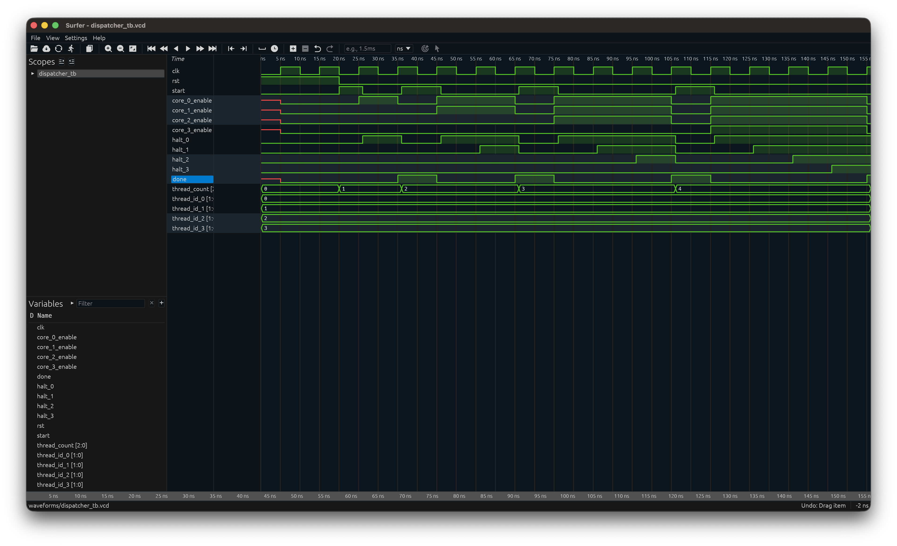;

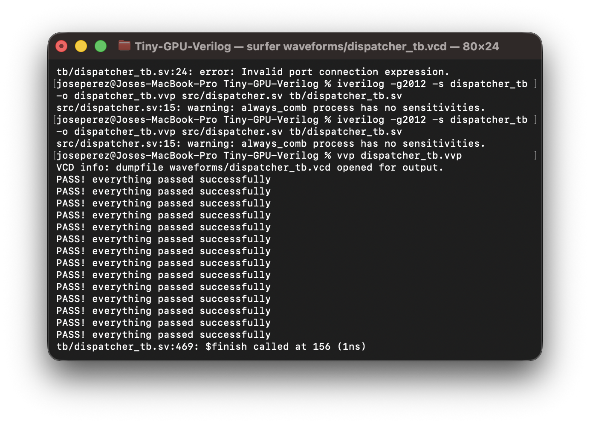;

### Compute Cluster
This module took a while to finish, especially because of the testbench. The purpose of the compute cluster is to combine the dispatcher with all four compute cores. The dispatcher uses `thread_count` to enable the requested number of cores and asserts done once every enabled core has been halted. 

#### Modified Modules
Two modules that were modified while creating the compute cluster: `compute_core` and `program_counter`. 

The `compute_core` module was given an additional input called `core_enable`. This allows the dispatcher to enable or disable each individual core. It also prevents a disabled core from updating any of its internal registers. 

The `program_counter` module was given an `enabled` input. When `enabled` is not asserted, the program counter holds its current values instead of moving advancing. This allows the dispatcher to keep unused cores disabled 

#### Testbench 
This was the longest testbench I had written at this point. This was mainly because of the number of inputs and outputs, instruction local parameters, the instruction logic for each core, and the self-checking task.

Each core executes a small program: first loads a value into `R1`. It then loads another value into `R2` and adds the two values together, storing the result in `R3`. Finally, each core stores `R3` at a different memory address.

Some cores execute additional `NOP` instructions before stopping or `HALTING`. This gives each program a different length and allows for the `done` signal to be verified that it only gets asserts until all the cores are halted.

The testbench also gives each core an instruction according to the core's program counter. It checks the program counters, memory addresses, memory write data, and memory write enables, and the final `done` signal. 


#### Four Active Cores
I also tested the cluster with different `thread_count` values: 
```verilog
thread_count = 3'd1 // Enables core 0 
thread_count = 3'd2 // Enables core 1
thread_count = 3'd3 // Enables core 2
thread_count = 3'd4 // Enables Core 3
```

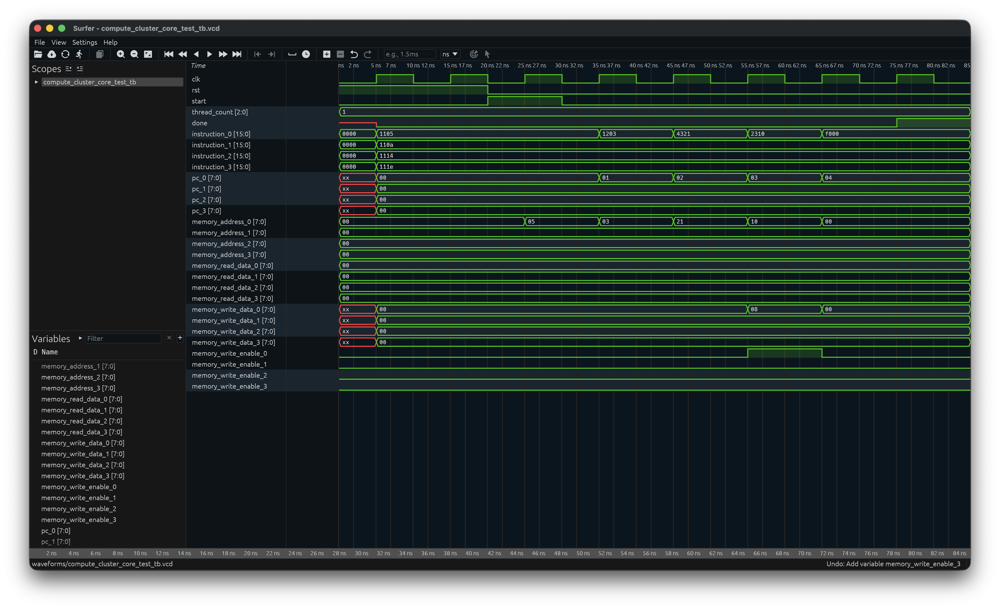

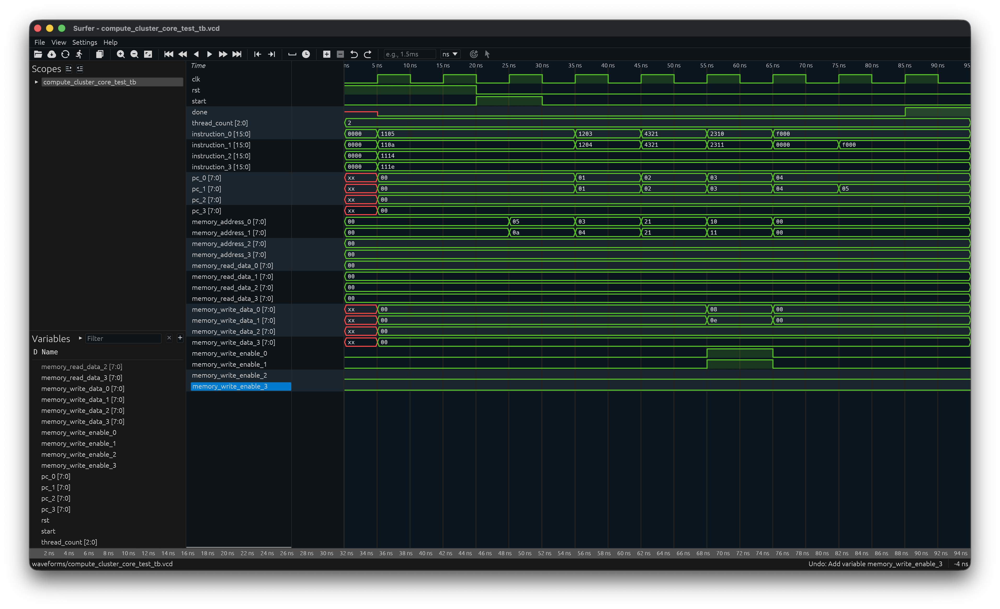


This tests all confirmed that the dispatcher correctly controls the four compute cores, each enabled core executes its own instructions, disabled cores remain inactive and `done` is only asserted after each active core has stoped

### Data Memory
Before implementing the data memory I modified the `control_unit`, `compute_core`, and `compute_cluster` modules so that they can support memory reads. The control unit now asserts a `mem_read` signal during a `LOAD` instruction. The compute core and compute cluster also got new `memory_read_enable` output signals allowing future cache and memory modules to determine when a core is requesting data 

After making these changes I retested the compute cluster to verify that both the memory read and write signals still work correctly. 

![Compute Cluster]../images/memory_cluster_updates/new_compute_cluster.png)

The data memory will serve as the primary storage for the program's data. It contains 256 memory locations that each hold an 8-bit value. The cache will sit between the cores and data memory and hold copies of recently accessed values.

Writes occur on the rising edge of the clock when `write_enable` is asserted. Reads are combinational, so when `read_enable` is asserted, `read_data` will display the values stored at that address. When reading is disabled, `read_data` outputs zero. 


#### Testbench 
The testbench begins by initializing all input signals to zero. It then performs the following test: 

1. Writes `0x08` to address `0x10` and reads it back.
2. Writes `0x10` to address `0x14` and verifies the stored value.
3. Reads address `0x10` again to ensure its original value was not changed by writing to another address. 
4. Overwrites address `0x10` with `0x12` and confirms that the value was updated correctly. 
5. Checks the `read_data` outputs zero whenever `read_enable` is disabled 

All tests passed confirming that the module can write, retain, read, and overwrite stored data correctly

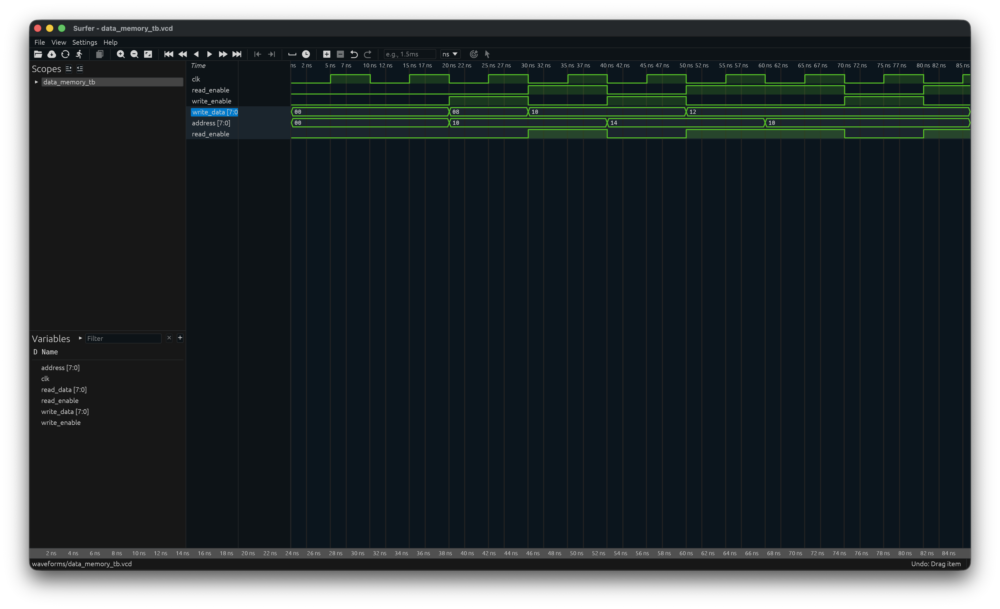

### Cache
The cache is a small memory between the compute cores and data memory. It keeps values fetched from data memory so repeated reads can be served without anothe rmemory access. 

A core request an operation using `core_read_enable` or `core_write_enable`. `core_address` gives the 8-bit address, and `core_write_data` supplies the value for a write. The cache uses part of the address as an index to select an entry. A read is a cache hit when the entry is valid and its stored tag matches the address. 

On a read hit, the cache returns its stored value through `core_read_data` and asserts `cache_hit` and `core_ready`. On a read miss, it asserts `memory_read_enable` and sends the full address through `memory_address`. The value arriving on `memory_read_data` is returned tot he core and stored in the cache for a later read. 

Writes are sent to data memory through `memory_write_enable`, `memory_address`, and `memory_write_data`. If the address is already cached, its cached value is updated too. A write miss does not fill the cache, so a later read of that address still misses. 

The main difficulty that arose while creating this module was how to implement the cache, since this was the first time I learned how cache works and also implementing it. 

#### Testbench
The testbench does a few things to very that the cache works.

1. The testbench provides an address and write data but leave both `core_read_enable` and `core_write_enable` low. It checks that the cache makes no memory request and keeps `core_ready` low too.

2. It request address `8'h2A`. The cache entry is invalid after reset since everything is all zero, so it misses. The cache request that address from memory, and the testbench supplies `8'h55` on `memory_read_data`. The cache returns `8'h55` to the core and stores it for the next read. 

3. Read `8'h2A` again. The previous read stored `8'h55` in a valid cache entry with a matching tag, so the cache returns `8'h55` without requesting memory. 

4. Write `8'h77` to `8'h2A`. The cache updates its existing entry and sends the write to data memory. 

5. Read `8h2A` again. The cache returns the updated `8'h77`, even though the testbench sets memory_read_data to `8'h00`. 

6. Write `8'h99` to `8'h3B`, whcih is not currently cached. The write goes to data memory, but this design does not create a cache entry for that write. 

5. Read `8'h3B`. It misses because the write did not fill the cache. The testbench supplies `8'h99` as the memory response. 

6. Repeat the read to check that the fill work. This time `cache_hit` becomes a `1`, and `memory_read_enable`is a `0`. The cache then returns `99` even thoguh the testbench change the memory_read_data to `00`. 

7. Checks for a conflict miss, this happens when two different memory addresses use the same cache slot. In the test `8'h2A` and `8'h7A` both use index `A`, but they both have two different tags (`2` and `7`). If you read from `7A` it replaces the catched `2A` entry. Wehn you read `2A`, its tag doesn't match so the cahe has to read from data memory. 

8. Read `7A`, is a hit because the cache replaced the entry at index `A` with tag `7` and a value of `CC`. 

9. Read `2A` uses the same index `A`, but different tag. It now is a miss because `7A` replaced it. 

10. IDLE state before a reset

11. Reset pulse in testbench

12. Reads `8'h2A` after the reset checks that testbench asserts reset between the two calls, invalidating cache entries. `2A` ahd just been fetched so the read checks that reset turns everything ito all zeros again. Since its a miss the cache checks the memory that the testbench supplies with `8'h66`.

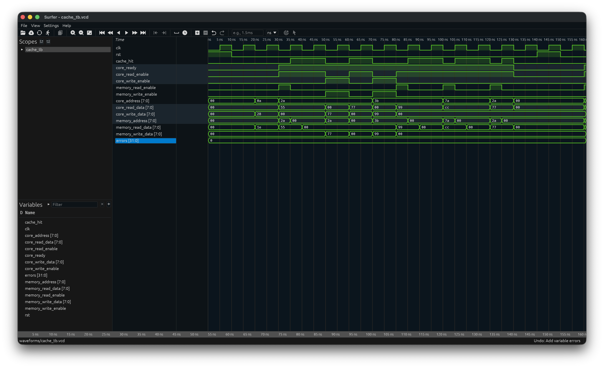

### Memory Arbiter 
The four compute cores can request memory concurrently, but the cache has only one request input. The memory arbiter selects one core, forwards its request to the cache, waits for a completion and sends the response back to the core. 

#### Modifications
Before I explain what the arbiter does and how I implemented it, there were a few changes to `compute_core.sv` and `compute_cluster.sv` 

compute_core: Added `memory_read_enable` so a `LOAD` can request a read and added `memory_ready` so `LOAD` and `STORE` wait for a cache completion. While waiting the PC and register writes are held, but the memory request stays asserted.

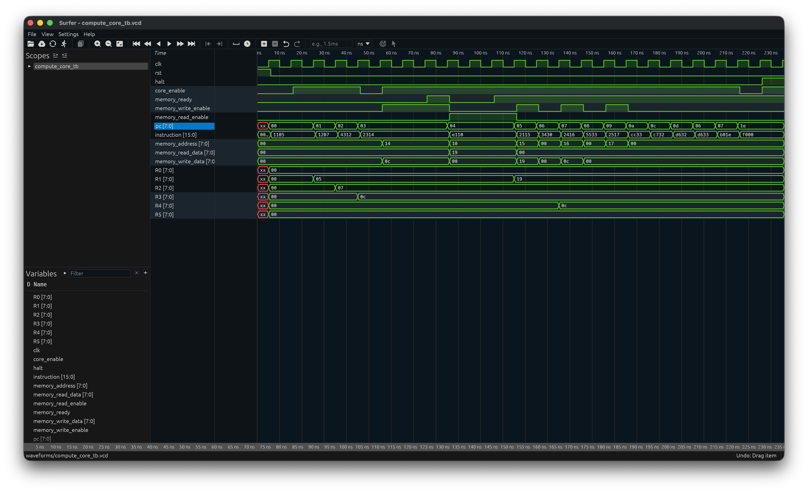

compute_cluster: exposed the `read)enable` and ready signals for each of the four cores, then connected each `memory_ready_0` - `memory_ready_3` input and `memory_read_enable_0` - `memory_read_enable_3` output to the matching core instances.

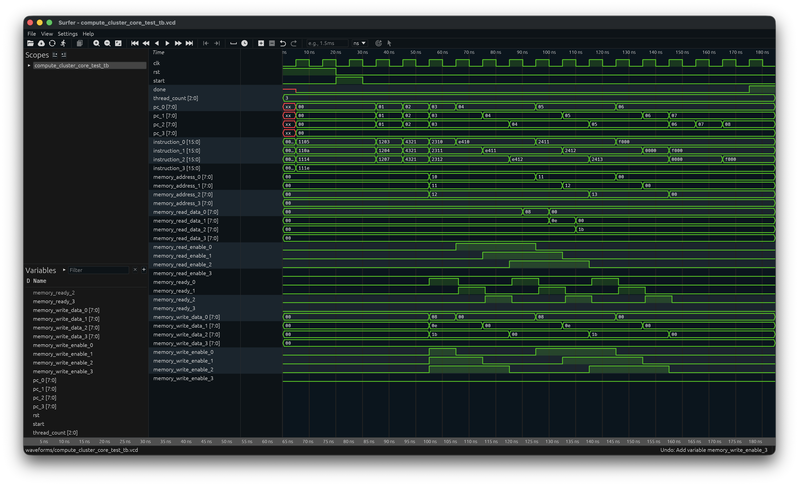

This was my first time implementing an arbiter, so I documented how its signals and control logic work. 

#### Core and cache interfaces 
`clk` determines when the arbiter updates its stored state, while rst returns it to `IDLE`. 

`core_read_enable[3:0]` and `core_write_enable[3:0]` contain one request per core. For example, 4'b0101 means cores 0 and 2 have a request. 

`core_address[3:0][7:0], core_write_data[3:0][7:0], and core_read_data[3:0][7:0]` each contain four 8'bit values. For example, core_address[2] is core 2's 8'bit address. Now on Surfer it displays the entire 32 bit value because it combines four 8-bit lanes. 

`core_ready[3:0]` contains one completion signal per core. Only the core whose request completed receives ready. 

#### States and selection
The arbiter has three states: 

- IDLE: Look for a requesting core and then goes to ACTIVE. 
- ACTIVE: Keep an uninifhsed request connected to the cache once finished it moves onto GAP. 
- GAP: Turn off the request and response signals for one clock. Then goes to IDLE 

The request vector combines each core's read and write enables. `selected_valid` indicates whether a core is selected, and `selected_core` identifies what core. `Owner` stores the identity of a core whose transaction is still in progress. 

The difference between `owner` and `selected_core` matters. `selected_core` is whether by combinational logic, while `owner` remembers the chosen core across clock cycles. 

When the arbiter is `IDLE`, an if/else if chain checks request in order from core 0 to core 3. This gives core 0 the highest priority.

When the arbiter is `ACTIVE`, it selects the stored owner instead of running the priority check again. This prevents another core from taking over while the cache is still handling the current requests. 

#### Routing the request and response
A combinational block forwards the selected core's read enable, write enable, address, and write data to the single cache interface. All outputs receive zero as there default so the cache sees no request when no core is selected. 

The cache_ready is asserted, the arbiter asserts `core_read[selected_core]`. For a read it also places `cache_read_data` on `core_read_data[selected_core]`. The other cores' ready signals remain low. 

A clock block controls the state transition. In `IDLE`, an unfinished request saves `selected_core` as owner and moves to `ACTIVE`. If the cache responds immediately, the arbiter goes straight to `GAP`. In `ACTIVE`, it stays with the same owner until `cache_ready` is asserted. After completion,`GAP` waits for one clock cycle until it returns to `IDLE`. 

This implementation uses a fixed priority. A core waiting at a lower priority must keep its request asserted until it is selected. 

#### Testbench 
The testbench tests the arbiter by itself. It acts as four cores by asserting requests, and it acts as the cache by supplying cache_ready and cache_read_data. Then it checks that the arbiter routes each request and response correctly. 

It test 
- IDLE after reset
- Core 0 and 2 read together: Core 0 wins because it has a higher priority. Its address 10 reaches the cache. 
- Delayed responses: While cache_ready = 0, core 0 keeps ownership, and core 2 can't take over 
- Read response: When the testbench supplies data `42` and asserts cache_ready, only core 0 receives `ready` and the data. 
- `GAP`: Outputs turn off for the GAP. Then core 2's waiting request at address 22 is served and receives `99`. 
- Write: Core 3's write of `55` to address 20 reaches the cache, and only core 3 receives completion 
- Immediate response: If the cache is already ready when core 1 requests a read, core 1 receives data `77` without entering active. 

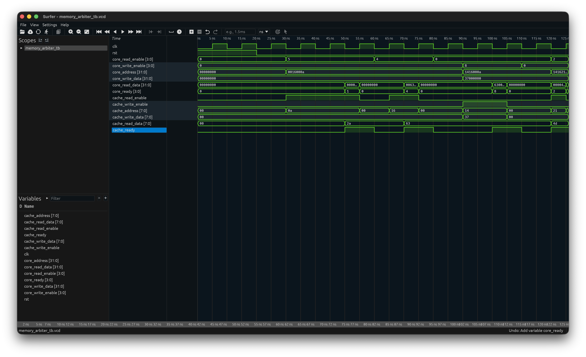

### Memory Cluster
The second-to-last module before fully integrating the top-level design of Tiny GPU. The memory cluster combines three crucial modules

- **Data Memory:** Stores values written by the cores.
- **Cache:** Keeps recently read values so a matching address can read without accessing data memory.
- **Memory Arbiter:** Selects one core's request at a time. If multiple core request memory, core 0 has the highest priority.

#### Testbench

The testbench acts as the four cores and checks the following cases:

1. **Write miss:** Core 0 writes `8'h34` to address `8'h84`. The write reaches data memory but does not fill the cache.
2. **Read miss:** Core 2 reads `8'h84`. Data memory returns `8'h34`, and the cache fills index 4.
3. **Write hit:** Core 3 writes `8'h32` to `8'h84`, updating both the cached value and data memory.
4. **Read hit:** Core 1 reads `8'h84` and receives `8'h32` from the cache.
5. **Simultaneous requests:** Cores 0 and 2 request memory together. Core 0 is served first, followed by core 2's write to `8'h85`.
6. **Read after a write miss:** Core 3 reads `8'h85` and receives the value core 2 wrote. The read misses because the earlier write did not fill the cache.
7. **Tag replacement:** Reading `8'h94` replaces `8'h84` at cache index 4. Reading `8'h84` again replaces it back, changing the stored tag from `8` to `9` to `8`.

The testbench checks the expected data, ready signals, memory request, and cache contents. It stops with an error if the check fails.

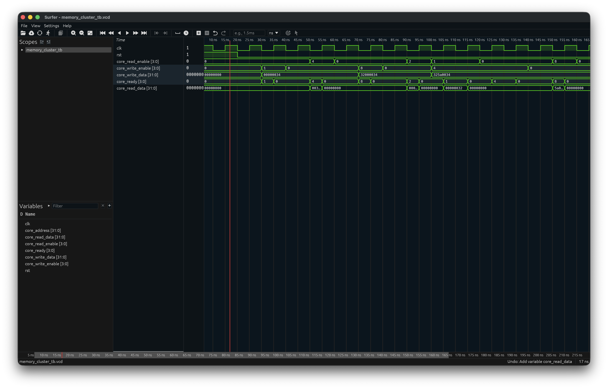;

;

### Tiny GPU 
After building and testing all individual modules, I finally have a working Tiny GPU top-level integration!

The `Tiny_gpu` module connects the four core compute cluster to the memory cluster which contains the memory arbiter, cache, and data memory. 

The single-core end-to-end test passes. An end-to-end multicore test is still needed to validate all four cores executing through the shared memory system simultaneously!

#### Testbench
The test enables core 0 while keeping cores 1-3 disabled. Instructions are supplied according to core 0's program counter. 

The program performas these eight operations: 

1. Load the immediate value 5 into R1.
2. Load the immediate value 7 into R2.
3. Add R1 and R2, storing 12 in R3.
4. Store R3 at memory address 0x00.
5. Load the value at memory address 0x00 into R4.
6. Add R1 and R4, storing 17 in R5.
7. Store R5 at memory address 0x21.
8. Execute HALT to stop core 0's instruction execution.

The testbench checks that the completed STORE operations write 12 to `0x00` and 17 to `0x21`, then waits for `done before ending the simulation. The second result verifies that the loaded values used correctly in the following calculations. 

### Waveform 


The waveform shows core 0 progessing through the program, holding its PC during the LOAD, and halting at PC 7. The other three cores remain at PC 0, and `done` asserts after execution completes. 

# What I learned
This projected helped me understand how instruction execution, emmory handshaking, caching, and arbitration work together. Testing each module separatly before integrating the full design made debugging more manageable and helped me build confidence int he system's behavior. 